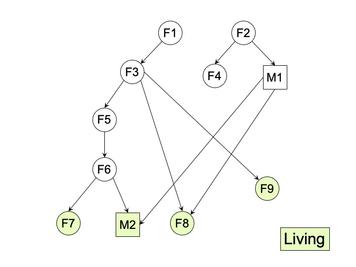

# Homework #7

## Due date: Tuesday, March 8, 2022

## This homework has 100 points

## Objectives:

Learn how to use a relational query language with recursion (datalog) to query graphs.  

**Assignment tools:**

[Soufflé](https://souffle-lang.github.io)

**What to turn in:** The files `hw7-q.dl` along with the outputs `hw7-q1.ans`, `hw7-q2.ans`, `hw7-q3.ans`, `hw7-q4.ans`, and `hw7-q5.ans` (see details below)

**Resources:**

- [Soufflé](https://souffle-lang.github.io)
- Soufflé [language documentation](https://souffle-lang.github.io/docs.html)
- [Soufflé tutorial](https://souffle-lang.github.io/tutorial)
- Starter code in the `starter-code` folder
- General information:
  - The [Mitochondrial Eve](https://en.wikipedia.org/wiki/Mitochondrial_Eve)
  - List of [women in the Bible](https://en.wikipedia.org/wiki/List_of_women_in_the_Bible)
  - List of [minor biblical figures](https://en.wikipedia.org/wiki/List_of_minor_Old_Testament_figures,_A%E2%80%93K)
  - Note that the parent-child relationship is randomly generated and may change.

## Assignment Details

### Background: Mitochondrial Eve

Every human has a mother, who had her own mother, who in turn had her own mother.  The matrilineal ancestor of an individual consists of the mother, the mother’s mother, and so on, following only the female lineage.  A matrilinial common ancestor, MCA, is a matrilinial ancestor of all living humans.  An MCA is very, very likely to exist (why?), and in fact there are many MCAs.  The matrilineal most recent ancestor, or MRCA, is the only individual (woman) who is the MCA of all living humans and is the most recent such.  Who is she?  When did she live?  In the 1980s three researchers, Cann, Stoneking and Wilson, analyzed the mitochondrial DNA of living humans and determined that the MRCA lived about 200,000 years ago.  The researchers called her the [Mitochondrial Eve](https://en.wikipedia.org/wiki/Mitochondrial_Eve).

In this homework, you will analyze a database of 800 individuals, compute several things, culminating with the the computation of the Mitochondrial Eve.  The genealogy database consists of over 800 biblical names, obtained from Wikipedia, with a randomly generated parent-child relationship.

### Getting Started

1. Install Soufflé
    1. **Best**: follow the instructions given in the sections OR just google `install souffle`.

    2. **Mac user**
        - Download and install using brew: 
        - `brew install --HEAD souffle-lang/souffle/souffle`
        - if the above command did not work and your Mac OS < 11.4, try: `brew install souffle-lang/souffle/souffle`.

    3. **Mac or Linux/Attu user**
        - Download the [souffle-lang](https://github.com/souffle-lang/souffle) (or go directly to [releases](https://github.com/souffle-lang/souffle/releases/tag/2.1))

        (Note: If these instructions aren't working for Linux, follow from step 5 for Windows)

    3. **Windows user**
        - To ease the installation process, we recommend using the pre-built version of Soufflé on Debian.
        - Download the [VMware Player](https://my.vmware.com/en/web/vmware/downloads/info/slug/desktop_end_user_computing/vmware_workstation_player/16_0).
        - Download the [Debian Image](https://www.debian.org/distrib/netinst). Make sure you install the amd64 version.
        - When VMware Player starts running, click on the "New Virtual Machine" button.  Navigate to the folder where you store the Debian Image. Click "OK".  Then click on the left-side tab that appears containing the VM name. Click "Play virtual machine". Follow the installation guide to finish setting up Debian. This may take up to an hour.
        - When Debian is setup, obtain the pre-built package [souffle_2.0.2-1_amd64.deb](https://github.com/souffle-lang/souffle/releases/tag/2.0.2)
        - Open a terminal and navigate to the location where you downloaded the package (which is probably `~/Downloads`)
        - Then type `sudo apt install ./souffle_2.0.2-1_amd64.deb`

    4. More [Documentation](https://souffle-lang.github.io/install)

2. Verify Soufflé is working:

   ```shell
   cd starter-code
   souffle hw7-q.dl
   ```

   Congratulations! You just ran your first datalog query.

### Questions

For each question below, write in the file `hw7-q.dl` a program that computes the answer to that question. See the Example section below.

1. (20 points) Find all descendants of Priscilla and their descriptions.  Name your predicate `p1(x,d)`. Write the output to a file called `hw7-q1.ans`(123 rows)

2. (20 points) Find the woman/women with the largest number of children and the man/men with the largest number of children. For each individual, you should return the name of that individual, his/her description, and the number of children. Name your predicate `p2(x,d,n)`. Write the output to a file called `hw7-q2.ans`(2 rows)

3. (20 points) For each person x, we call a "complete lineage" any sequence x0=x, x1, x2, … , xn where each person is the parent of the previous person, and the last person has no parents; the length of the sequence is n.  If x has a complete lineage of length n, then we also say that "x is in generation n".  Compute the minimum and maximum generation of each living person x.

    Name your predicate `p3(x,m1,m2)`, where x is a living person, and `m1`, `m2` are the minimal and maximal generation respectively. (Hint: You may want to first compute all generations for all x: think about when can you say that x is in generation 0, and when can you say that x is in generation n+1.  Of course x can be in multiple generations, e.g., x's mother is in generation 0 and x's father is in generation 2.   Once you know everybody's generations, you can answer the problem easily.) Write the output to a file called `hw7-q3.ans` (22 rows)

4. (20 points) Compute all matrilineal common ancestors, MCA. Name your predicate `p4(x)`. Write the output to a file called `hw7-q4.ans` (6 rows)

5. (20 points) Find the mitochondrial Eve.  Name your predicate `p5(x)`. Remember that you can utilize your predicates defined earlier. Write the output to a file called `hw7-q5.ans` (1 row)

#### Example

For example, suppose the question were: find all children of Priscilla; return their names and their descriptions. Then you write this in the `hw7-q.dl` file (it’s already there):

```c
.output p0(IO=stdout)
p0(x,d) :- parent_child("Priscilla",x), person(x,d).  // NOTE the period at the end
```

Further, suppose the data consists of the following genealogy, with 9 women `F1,...,F9` and 2 men `M1,M2`:

  

Your answer to question 3 should be: `p3(F7,4,4),p3(M4,2,4),p3(F8,2,2),p3(F9,2,2)`.  The MCAs are `F1,F3`, and the mitochondrial Eve is `F3`

## Submission Instructions

Write all your solutions in `hw7-q.dl`.  Furthermore, write the output generated by the queries p1, p2, p3, p4, p5 in files called `hw7-q1.ans`, `hw7-q2.ans`, `hw7-q3.ans`, `hw7-q4.ans`, `hw7-q5.ans`. Upload these **6** files to Gradescope.
